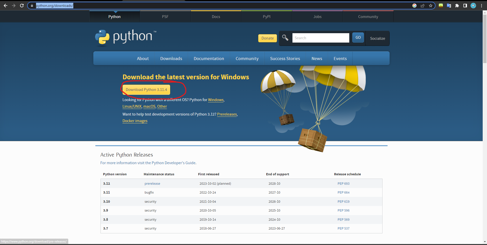

# **Hướng dẫn sử dụng**
## **Cách tải python và code**

### **Tải python**

- tải python tại link sau: <https://www.python.org/downloads/>
    - Tải phiên bản mới nhất
    <div align="center">
        
    </div>

    - Cài đặt python như cài đặt file exe bình thường
        - Lưu ý tích như hình bên dưới để cài đặt
        <div align="center">
        
    </div>


### **Tải source code**

- tải source code tại link sau: <https://github.com/batamsieuhang/collect_coin_data/archive/refs/heads/main.zip>


- Giải nén tệp zip như bình thường


### **Chạy code**

- Vào folder code được giải nén, dùng tổ hợp `Shift` + `chuột phải`, sau đó chọn open `PowerShell window here` để bật terminal
        <div align="center">
        
    </div>


#### *Ví dụ về các chạy code*

**Ví dụ 1**

```bash
python main.py 1 2 3 4 2
```


- 1 2 3 4 là các ô 1m, 2m, 3m, 4m
- 2 là tùy chọn hiển thị các % tăng của các coin xuất hiện từ 2 lần trở nên

<div align="center">
        
    </div>


**Ví dụ 2**

```bash
python main.py 10 15 20 3
```

- 10 15 20 là các ô 10m, 15m, 20m
- 3 là tùy chọn hiển thị các % tăng của các coin xuất hiện từ 3 lần trở nên

<div align="center">
        
    </div>


**Lưu ý**
- Có thể bật nhiều tab cùng 1 lúc bằng cách lặp lại như các chạy code
<div align="center">
        
    </div>

